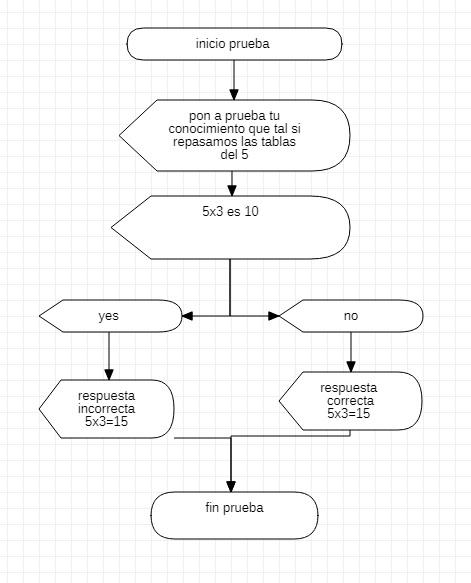

| ***REPRESENTACION DE VARIABLES EN DISTINTOS ESCENARIOS*** |
| --------------------------------------------------------- |

 En la clase de hoy aprendi con el instructor henry las diferentes formas de<br>
  representar el inicio y el fin de un programa y como mostrar texto en un sencillo programa.<br>  <br>  <br> **Formas de como se representa inicio y fin de un programa**<br>  

 ***STARUML*** se crea un diagrama de flujo y se representa
```
  inicio (terminal)
   "hola mundo"[mostrar en pantalla]
  fin (terminal)
```

  ***ALGORITMO***  se escribe inicio y fin para iniciar y terminar el programa <br>
  se utiliza la variable (escriba) para  mostrar texto en pantalla

```
  inicio
   escriba "hola mundo"
  fin
```

   ***DARTPAD*** se escribe vold main(){  } y  para mostrar texto en pantalla<br>
   print ('')
  ```
  vold main(){
    print ('hola mundo');
  }
```

 ***EXEL (VISUAL BASIC)*** se escribe sub ejempplo() End sub" para el inicio y<br>
 el fin  para mostrar texto en panlla msgbox""

```
sub ejemplo ()
  msgbox "hola mundo"
End Sub"          
```

***COMPROMISO: HACER 3 MENSAJES CON MSGBOX***

```
Sub prueba()
MsgBox "pon a prueba tu conocimiento que tal si repasamos las tablas del 5"

  Dim pregunta As String

  pregunta = MsgBox("5x3 es 10", vbYesNo + vbQuestion, "tabla de 5")

   If pregunta = vbNo Then
   MsgBox "respuesta correcta 5x3=15"

   Else

    MsgBox "es incorrecto 5x3=15"

    End If

End Sub
```

