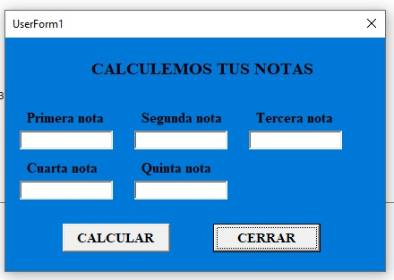

| ***VAEIABLE IF (VERDADERO O FALSO)*** |
| --------------------------------------------------------- |

En esta clase aprendimos como redireccionar el flujo de un programa con IF<br>
poniendo una condicion y desviando el flujo si cumple o no con la condicion

 ***IF CONDICION***
```
Sub ejemplo 1()
    n = Int(Inputbox("DIGITE UN NUMERO"))

    If ( n > 10) Then
      MsgBox "EL NUMERO " & n & "ES IGUAL O MAYOR QUE 10"
    Else
      MsgBox "EL NUMERO " & n & "ES IGUAL O MENOR QUE 10"

    End If
End Sub
```

  ***COMPROMISO*** crear un pequeño programa que calcule el promedio de notas

```
Sub inicio()
       MsgBox "BIENVENIDO VAMOS A CALCULAR TUS NOTAS"
       n1 = InputBox("ESCRIBA LA PRIMERA NOTA")
       n2 = InputBox("ESCRIBA LA SEGUNDA NOTA")
       n3 = InputBox("ESCRIBA LA TERCERA NOTA")
       n4 = InputBox("ESCRIBA LA CUARTA NOTA")
       n5 = InputBox("ESCRIBA LA QUINTA NOTA")
       p = Int(n1) + Int(n2) + Int(n3) + Int(n4) + Int(n5)
       r = p / 5

       If (r > 7) Then
         MsgBox "EL PROMEDIO ES  " & r & " ESTAS APROBADO "
       Else
         MsgBox "EL PROMEDIO ES  " & r & " ESTAS REPROBADO"
       End If
   End Sub
   ```

***FORMS***
   

   

   
   
   
