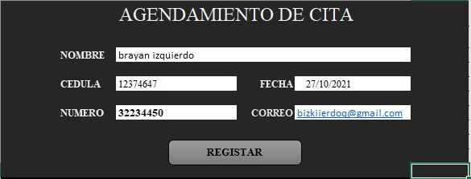
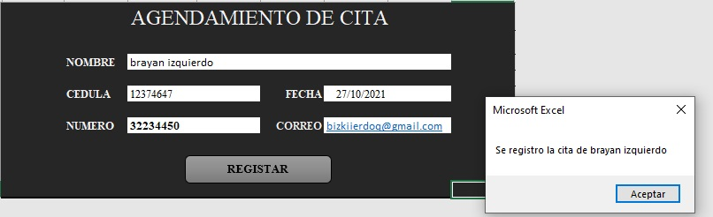
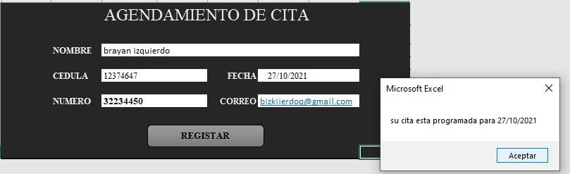
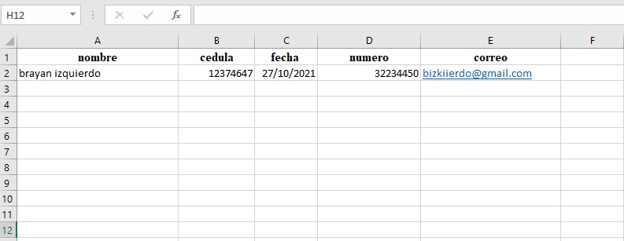

| ***CONDICIONALES*** |
| --------------------------------------------------------- |

Aprendimos a usar las condicionales en las hojas de excel y a como crear<br>
una funccion en excel,

 ***CELLS*** Ejemplo
```
Sub prueba1()
  datos.Cells(#fila, #columna) = form.Cells(#fila, #columna)
  datos.Cells(#fila, #columna) = form.Cells(#fila, #columna)
  MsgBox "datos registrados"
  form.Cells(#fila, #columna) = Empty
  form.Cells(#fila, #columna) = ""
End Sub
```

  ***COMPROMISO*** crear registro en hoja de excel y crear una fuccion
```
Sub info()
    datos.Cells(2, 1) = form.Cells(6, 7)
    datos.Cells(2, 2) = form.Cells(8, 7)
    datos.Cells(2, 3) = form.Cells(8, 10)
    datos.Cells(2, 3) = form.Cells(10, 7)
    datos.Cells(2, 5) = form.Cells(10, 10)
    nc = forms.cells(6, 7)
    f = forms.cells(8, 10)
    MsgBox "Se registro la cita de " & nc
    msgbox "para la fecha " & f
    form.Cells(3, 5) = ""
    form.Cells(5, 5) = ""
    form.Cells(7, 5) = ""
    form.Cells(9, 5) = ""
    form.Cells(11, 5) = ""
End sub

Function notasSena (s, u, g, b, c)
    promedio = (s + u + g + b + c) / 5
    If (promedio < 7) Then
        notasSena = " con esta nota " & promedio & " aprobo"
    Else
        notasSena = " con esta nota " & promedio & " reprobo"
    End If
End Function
   End Sub
   ```

***FORMS***

   

   

   

   
