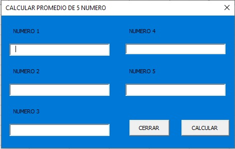

| ***REPRESENTACION DE VARIABLE SUMA Y PROMEDIO *** |
| --------------------------------------------------------- |

En esta clase aprendimos como adicionar calculos matematicos<br>
y mediante la variable InputBox crear un espacio en donde intereactuar<br>
con el programa.

 ***VARIABLE INPUTBOX*** con esta variable podemos crear un cuadro de texto<br>
 donde podamos escribir (para la representacion de numero usar ***Int***)
```
Sub promedio()
N1 = InputBox("digite su primer numero")
N2 = InputBox("digite su segundo numero")
N3 = InputBox("digite su tercer numero")
N4 = InputBox("digite su cuarto numero")
N5 = InputBox("digite su quinto numero")
S = Int(N!) + Int(N2) + Int(N3) + Int(N4) + Int(N5)
R = Int(S) / 5
MsgBox "EL PROMEDIO ES = " & g
End Sub
```

  ***COMPROMISO*** crear en visual basic un programa que calcule el<br>
  promedio de 5 numeros

```
Sub promedio()
msgbox " CALCULEMOS EL PROMEDIO DE 5 NUMEROS "
N1 = InputBox("digite su primer numero")
N2 = InputBox("digite su segundo numero")
N3 = InputBox("digite su tercer numero")
N4 = InputBox("digite su cuarto numero")
N5 = InputBox("digite su quinto numero")
S = Int(N!) + Int(N2) + Int(N3) + Int(N4) + Int(N5)
R = Int(S) / 5
End Sub
MsgBox "EL PROMEDIO ES = " & g
```

   ***ME PARECIO INTERESANTE***
   indagando en el programa me di cuenta que podia representarlo<br>
   luego investigue y aqui lo practicado

```
Private Sub Calcular_Click()
Dim N1 As Double
Dim N2 As Double
Dim N3 As Double
Dim N4 As Double
Dim N5 As Double
Dim S As Double
Dim p As Double

N1 = DN1
N2 = DN2
N3 = DN3
N4 = DN4
N5 = DN5
S = Int(N2) + Int(N2) + Int(N3) + Int(N4) + Int(5)
p = Int(S) / 5
MsgBox " EL PROMEDIO ES = " & p

End Sub

Private Sub Cerrar_Click()
End
End Su

```


